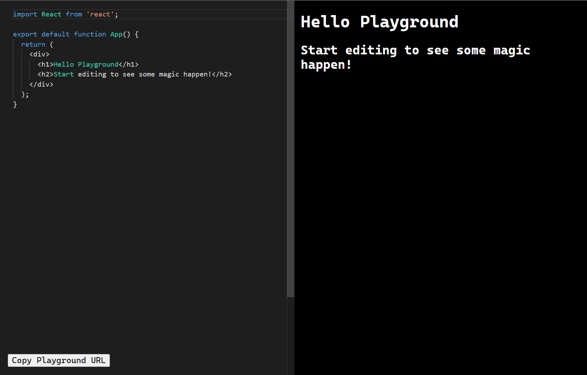

# React Playground

A simple React playground that renders your app live. Built mostly following this example https://github.com/souporserious/build-your-own-code-playground with some notable changes:

- Uses `@urlpack/json` for more compact shareable URLs
- Uses Monaco Editor for code editing

